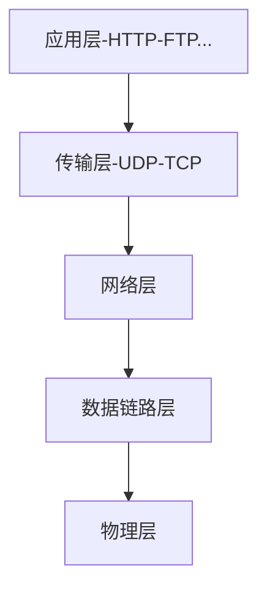

```mermaid
graph TB;

应用层-HTTP-FTP... --> 传输层-UDP-TCP --> 网络层 --> 数据链路层 --> 物理层
```

http协议基于tcp/ip协议

物理层：定义物理设备如何传输数据。

数据链路层：最基本的服务是将源计算机网络层传输来的数据传输到相邻目标计算机的网络层。

网络层：定址和寻址。

传输层：建立端到端的服务，包含两种类型的协议，传输层向高层屏蔽了下层数据通信的细节。

应用层：为软件提供了很多服务，比如发信息、写邮件等，构建于TCP协议之上。
